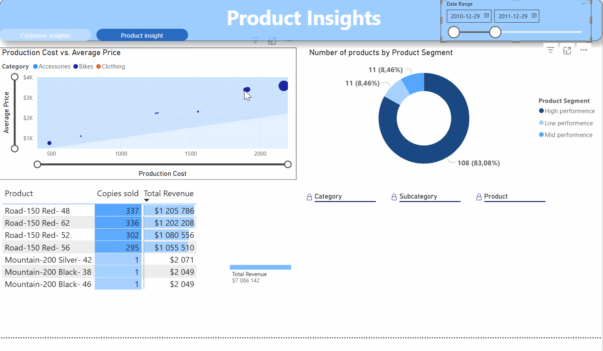
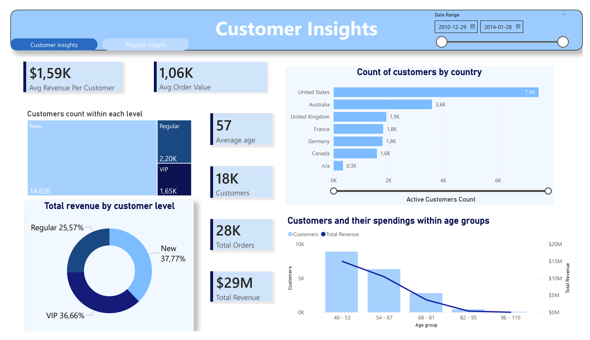
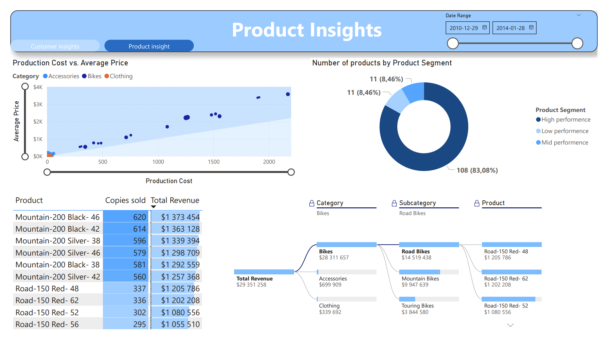

# End-to-End Data Werhouse and Data Analytics Project in SQL

*(Dynamic demo of the final Power BI Dashboard)*

## Acknowledgements & Inspiration
This project started as an implementation of the **"Build a Data Warehouse from Scratch"** SQL course by **[Data With Baraa](https://www.youtube.com/@DataWithBaraa)**.

**Extension:** While the original course focused on building the Data Warehouse (ETL, Bronze/Silver/Gold layers) and SQL Views, **I extended the project by building a full-scale Power BI Analytics Solution** on top of the data warehouse. This includes advanced data modeling, dynamic DAX measures, and interactive storytelling dashboards.

---

## Project Overview
The goal of this project was to transform raw sales data into actionable business insights. The solution simulates a real-world BI environment where data is extracted, transformed, and loaded (ETL) into a Star Schema, and then visualized to answer strategic questions about sales performance, customer behavior, and product profitability.

### Key Business Problems Solved
1.  **Customer Segmentation:** utilizing RFM-style logic to categorize customers (VIP, Regular, New) and analyze their spending habits.
2.  **Profitability Analysis:** Determining which products drive actual profit vs. just revenue (Cost vs. Price analysis).
3.  **Sales Performance:** Tracking revenue trends across different regions and time periods dynamically.

---

## Architecture & Tech Stack

The project follows a modern "Medallion Architecture" approach:

### 1. Data Warehouse (SQL Server)
* **Bronze Layer:** Raw data ingestion.
* **Silver Layer:** Data cleaning, normalization, and standardization (handling nulls, formatting dates).
* **Gold Layer:** Business-ready data modeled into a **Star Schema** (Fact & Dimensions).
* **SQL Skills Used:** `CTEs`, `Window Functions`, `Views`, `Data Type Casting`, `Date Dimension generation`.

### 2. Data Analytics (Power BI) - *My Extension*
* **Data Modeling:** Established One-to-Many relationships between Fact (Transactions) and Dimension (Customers, Products) tables.
* **DAX Measures:** Created dynamic calculations for time-intelligence:
    * `Active Customers Count` (Distinct Count)
    * `Avg Order Value` (Dynamic aggregation)
    * `% Orders by Age` (CALCULATE + ALLSELECTED context manipulation)
* **Advanced Visuals:**
    * **Decomposition Tree:** For deep-dive root cause analysis of sales.
    * **Scatter Plot with Symmetry Shading:** To visualize the correlation between Production Cost and Sales Price.
    * **Page Navigation:** App-like experience with custom buttons and bookmarks.

---

## Dashboard Showcase

### 🔹 Page 1: Customer Insights
Focuses on user demographics and behavior.
* **Features:** VIP/New Customer segmentation, Age & Gender distribution, Top Countries by Revenue.
* **Insight:** Helps the marketing team target specific high-value demographics.

### 🔹 Page 2: Product Insights
Focuses on inventory performance and margins.
* **Features:** "Top 10 Products" dynamic list, Profitability Matrix (Scatter Plot), Sales breakdown by Category hierarchy.
* **Insight:** Identifies products with high sales volume but low margins versus high-margin "Gold" products.

